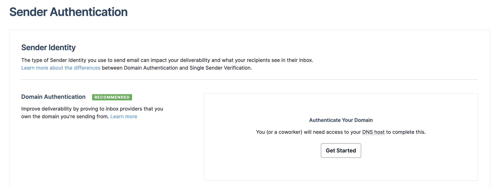

<div align="center">


# Sendgrid with Qwik

For more information, please read carefully [@sendgrid/mail](https://www.npmjs.com/package/@sendgrid/mail) documentation

</div>

### 1. Create a Qwik project with `npm create qwik@latest`

### 2. Sign into [https://sendgrid.com/](https://sendgrid.com/) and create an account

### 3. Go to **API Keys** in **Settings** and create a new one for your app

### 4. Verify an email address as in the [Sender Authentication tab](https://app.sendgrid.com/settings/sender_auth/senders) or you will receive a 403 in the response

### 5. Put your API key in a .env file in the root of your repo

```env
PUBLIC_SENDGRID_API_KEY=<<YOUR_COOL_API_KEY>>
```
### 6. Install the sendgrid package with `npm install @sendgrid/mail`

### 7. Check up what is done in `src/routes/index.tsx` (where the form is) and `src/routes/success/index.tsx` (where the user will land after submiting)

## ❗️ Main Issues

Surely you will receive your emails in the SPAM folder. In order to make them land in the proper folder, you will have to do the [Domain Authentication on sendgrid](https://app.sendgrid.com/settings/sender_auth). 

